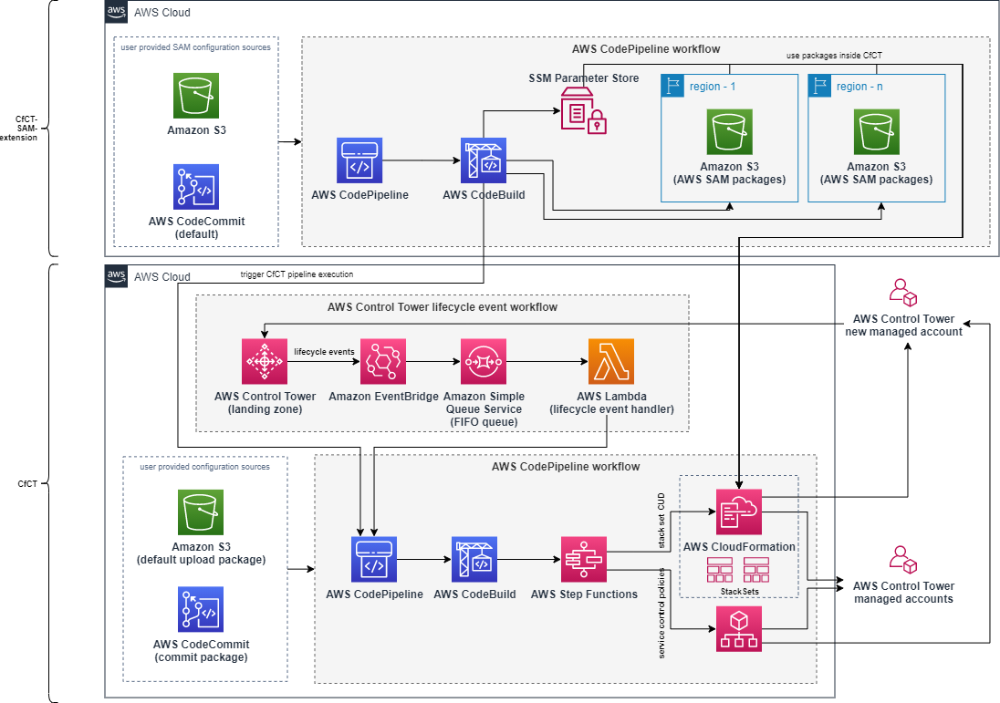

# Customizations for Control Tower - AWS SAM extension <!-- omit from toc -->

## Table of Contents <!-- omit from toc -->
- [Solution Overview](#solution-overview)
- [Use Cases](#use-cases)
- [Limitations](#limitations)
- [FAQ](#faq)
- [License](#license)


## Introduction <!-- omit from toc -->
Customers want flexibility and simpler ways to manage their AWS accounts.
There are several ways customers can choose to customize their AWS account deployments at scale with flexibility such as [Account Factory Customization (AFC)](https://docs.aws.amazon.com/controltower/latest/userguide/af-customization-page.html) a native solution within AWS Control Tower account factory, or [Customizations for Control Tower (CfCT)](https://docs.aws.amazon.com/controltower/latest/userguide/cfct-overview.html) which this repository focuses on.
To perform account level operations with flexibility and less code, customers can use [AWS Serverless Application Model (AWS SAM)](https://aws.amazon.com/serverless/sam/) integration with CfCT that provides an easy way to establish a multi-account environment focused on operational excellence, security, reliability and performance.

Customers can use AWS SAM and CfCT to perform account level operations such as deploying security services, serverless / event driven workflows, as well as implementing cost controls with significantly less code.
AWS SAM takes care of minimizing overhead of complex deployments by taking care of packaging the customizations.

In this repository we describe how to provision and customize AWS accounts at scale using AWS SAM and CfCT leveraging customization workflows with AWS SAM packages.
These packages are centrally stored in the management account to reduce management overhead and simplify maintenance.
There is no need to store the packages in the member accounts.
We describe how to configure CfCT AWS SAM extension to build and package AWS SAM projects automatically.
The solutions can be easily scaled to multiple AWS regions managed with AWS Control Tower.

A deployment walkthrough is described in the blog post [Simplify infrastructure deployments using Customizations for AWS Control Tower and AWS Serverless Application Model](https://aws.amazon.com/blogs/mt/simplify-infrastructure-deployments-using-customizations-for-aws-control-tower-and-aws-serverless-application-model/).


## Solution Overview
The solution leverages an additional AWS CodePipeline which builds and stores AWS SAM packages before triggering CfCT to roll out changes.
As there are only two integrations to the official CfCT (CfCT deployment activation trigger and [AWS Systems Manager Parameter Store referencing](https://docs.aws.amazon.com/controltower/latest/userguide/alfred-helper.html)), the solution can be used as extension to CfCT that customers can easily enable and disable.
As AWS SAM stores packages inside Amazon Simple Storage Service (Amazon S3), the corresponding locations will be stored as AWS Systems Manager parameters to be referenceable for CfCT parameters within [manifest.yml](https://docs.aws.amazon.com/controltower/latest/userguide/cfct-manifest-file-resources-section.html) file.



CfCT can leverage SAM until certain degree by adding `Transform: AWS::Serverless-2016-10-31`.
However this will not include Amazon S3 packaged resources to be deployed.
CfCT-SAM-extension itself closes the gap for the following AWS SAM features.

| CFN SAM resource                                                                                                                               | Supported by CfCT                                                    | Additional support by CfCT-sam-extension                           |
| ---------------------------------------------------------------------------------------------------------------------------------------------- | -------------------------------------------------------------------- | ------------------------------------------------------------------ |
| [AWS::Serverless::Api](https://docs.aws.amazon.com/serverless-application-model/latest/developerguide/sam-resource-api.html)                   | Will work as inline string but not as an S3 path for the definition. | Provides S3 path support as definitions are stored and referenced. |
| [AWS::Serverless::Application ](https://docs.aws.amazon.com/serverless-application-model/latest/developerguide/sam-resource-application.html)  | S3 path required, but unsupported.                                   | Provides S3 path support as definitions are stored and referenced. |
| [AWS::Serverless::Function](https://docs.aws.amazon.com/serverless-application-model/latest/developerguide/sam-resource-function.html)         | Will work as inline string but not as an S3 path for the definition. | Provides S3 path support as definitions are stored and referenced. |
| [AWS::Serverless::HttpApi](https://docs.aws.amazon.com/serverless-application-model/latest/developerguide/sam-resource-httpapi.html)           | Will work as inline string but not as an S3 path for the definition. | Provides S3 path support as definitions are stored and referenced. |
| [AWS::Serverless::LayerVersion](https://docs.aws.amazon.com/serverless-application-model/latest/developerguide/sam-resource-layerversion.html) | S3 path required, but unsupported.                                   | -                                                                  |
| [AWS::Serverless::SimpleTable](https://docs.aws.amazon.com/serverless-application-model/latest/developerguide/sam-resource-simpletable.html)   | Yes, fully.                                                          | -                                                                  |
| [AWS::Serverless::StateMachine](https://docs.aws.amazon.com/serverless-application-model/latest/developerguide/sam-resource-statemachine.html) | Will work as inline string but not as an S3 path for the definition. | Provides S3 path support as definitions are stored and referenced. |


Integration of stored SAM packages can be referenced within CfCT as AWS Systems Manager parameters like this:

*manifest.yaml*
```yaml
  - name: test-sam-extension
    resource_file: test-sam-extension.yaml
    deploy_method: stack_set
    parameters:
      - parameter_key: SAMExtensionBucketsPrefix
        parameter_value: $[alfred_ssm_/cfct-sam-extension/package-buckets-prefix]
      - parameter_key: TestServerlessFunctionPackagePath
        parameter_value: $[alfred_ssm_/cfct-sam-extension/serverless-functions/test-lambda]
    deployment_targets:
      organizational_units:
        - OUName1
        - OUName2
```

*test-sam-extension.yaml*
```yaml
AWSTemplateFormatVersion: 2010-09-09
Transform: AWS::Serverless-2016-10-31

Parameters:
  SAMExtensionBucketsPrefix:
    Type: String
  TestServerlessFunctionPackagePath:
    Type: String

Resources:
  TestLambda:
    Type: AWS::Serverless::Function
    Properties:
      Handler: index.handler
      Runtime: python3.10
      CodeUri:
        Bucket: !Sub "${SAMExtensionBucketsPrefix}-${AWS::Region}"
        Key: !Ref TestServerlessFunctionPackagePath
```

## Use Cases
The [samples/cfct-sam-extension/serverless-applications](samples/cfct-sam-extension/serverless-applications) folder contains additional use cases.

- `custom-config-rule`: [Custom AWS Config rule using a Lambda function](https://docs.aws.amazon.com/config/latest/developerguide/evaluate-config_develop-rules.html#w2aac12c36b9) which checks for the EBS volume type
- `s3-block-public-access`: Lambda function to [enable S3 Block Public Access Block for the Account](https://docs.aws.amazon.com/AmazonS3/latest/userguide/configuring-block-public-access-account.html)
- `security-hub`: Lambda function to [enable PCI DSS Standard in Security Hub](https://docs.aws.amazon.com/securityhub/latest/userguide/pci-standard.html) (please make sure to [enable Security Hub](https://docs.aws.amazon.com/securityhub/latest/userguide/securityhub-enable.html) in all target accounts before deploying this use case)


## Limitations
- This solution allows to add new regions using the `EnabledRegions` parameter.
  However it does not handle the deletion of resources in subsequent stack updates. This includes created S3 buckets `cfct-sam-extension-packages-*`. If you remove an AWS region from `EnabledRegions` you need to manually delete the corresponding bucket. If you want to automatically delete all created buckets, please delete the stack.
  Also please check the [delete a stack set documentation for CfCT](https://docs.aws.amazon.com/controltower/latest/userguide/cfct-delete-stack.html).
- This solution does not handle the validation of regions provided via the `EnabledRegions` parameter.
  If a wrong region name is be provided, the stack deployment will fail.


## FAQ
1. **How do I set a different runtime version (e.g. Python 3.9 or Node.js 14)?**<br>
Use the [runtime-versions](https://docs.aws.amazon.com/codebuild/latest/userguide/build-spec-ref.html#build-spec.phases.install.runtime-versions) section in the `Buildspec` under `CustomControlTowerCodeBuild` resource in the [cfct-sam-extension.yaml](source/cfct-sam-extension.yaml) template to set the desired [runtime version](https://docs.aws.amazon.com/codebuild/latest/userguide/runtime-versions.html).
2. **I do receive the following error message when deleting the stack. What shall I do?**<br>
    ```
    Error: Stack cfct-sam-extension could not be deleted as it encountered DELETE_FAILED, msg: ex: Waiter StackDeleteComplete failed: Waiter encountered a terminal failure state: For expression "Stacks[].StackStatus" we matched expected path: "DELETE_FAILED" at least once, status: The following resource(s) failed to delete: [CustomControlTowerSamExtensionS3AccessLogsBucket].
    ```
    This happens in rare cases when S3 access logs are delivered to the the `CustomControlTowerSamExtensionS3AccessLogsBucket` after the `EmptyS3BucketsLambda` Lambda function did already run. Please manually [empty the S3 bucket](https://docs.aws.amazon.com/AmazonS3/latest/userguide/empty-bucket.html) `cfct-sam-extension-source-access-logs-<ACCOUNT_ID>` and try to [manually delete the Stack](https://docs.aws.amazon.com/AWSCloudFormation/latest/UserGuide/cfn-console-delete-stack.html) again.
3. **Why do I have to delete the CloudWatch Log Groups for the Lambda functions manually and it's not done by CloudFormation?**<br>
CloudFormation is indeed deleting the log groups, but they are automatically re-created via the custom resource Lambda invocation afterwards. See also [this re:Post](https://repost.aws/questions/QUzZH7Nz2DT_-PagH_godYYA) thread.

## License
See license [here](LICENSE.txt)
